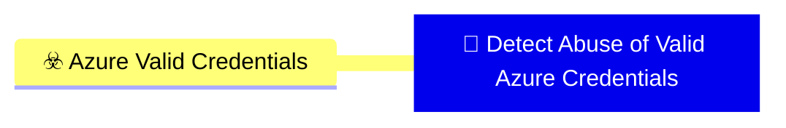

# 💡Detect Abuse of Valid Azure Credentials

**🚩 Priority : `Critical`**

🚦 **TLP:CLEAR** ⚪ : Recipients can spread this to the world, there is no limit on disclosure.

🗡️ **ATT&CK Techniques** :  [T1078.004 : Valid Accounts: Cloud Accounts](https://attack.mitre.org/techniques/T1078/004 'Valid accounts in cloud environments may allow adversaries to perform actions to achieve Initial Access, Persistence, Privilege Escalation, or Defense'), [T1110 : Brute Force](https://attack.mitre.org/techniques/T1110 'Adversaries may use brute force techniques to gain access to accounts when passwords are unknown or when password hashes are obtainedCitation TrendMic'), [T1555 : Credentials from Password Stores](https://attack.mitre.org/techniques/T1555 'Adversaries may search for common password storage locations to obtain user credentialsCitation F-Secure The Dukes Passwords are stored in several pla')

---

`🔑 UUID : f4a8b3c2-7e5d-4f1a-bc8e-9d2a6e7c8f0b` **|** `🏷️ Version : 1` **|** `🗓️ Creation Date : 2025-10-15` **|** `🗓️ Last Modification : 2025-10-15` **|** `👩‍💻 Model author : None` **|** `👥 Contributors : None` **|** `Sharing Organisation : {'uuid': '56b0a0f0-b0bc-47d9-bb46-02f80ae2065a', 'name': 'EC DIGIT CSOC'}` **|** `🧱 Schema Identifier : dom::1.0`

## 💡 Objective

**🏷️ Type** : Threat - Alerts meant for detection cybersecurity threats, and which should eventually trigger Incident Response  

> Detect when adversaries abuse valid Azure AD/Entra ID credentials to gain 
> unauthorized access to cloud resources. This detection objective focuses on 
> identifying anomalous authentication patterns, suspicious access behaviors, 
> and privilege abuse that indicate compromised credentials are being used 
> for malicious purposes.
> 
> Attackers obtain credentials through various means (phishing, password spraying, 
> credential leaks) and use them to authenticate legitimately to Azure services, 
> making detection challenging as the authentication itself appears valid. This 
> objective aims to identify the contextual anomalies and behavioral indicators 
> that differentiate legitimate use from credential abuse.
> 
> Key focus areas include:
> - Anomalous sign-in patterns (location, device, time, velocity)
> - Privilege escalation attempts post-authentication
> - Unusual resource access patterns
> - Service principal and application credential abuse
> - Cross-tenant authentication anomalies
> 

**🎼 Composition** : Risk - Advanced strategy where signals contribute a risk score over time to entitiesin a permanent risk store. This allows weak and strong signals to coexist, whileresponse switches from processing alerts to process a bundle of contributing signalsaround a high risk entity. This is essentially an evolution of the `Entity` and`Threshold` strategy, and adds a layer of risk calculation around entities using repeated signals as risk contributors. Different signals may contribute differentially,and also include decaying factors.

> This detection objective employs a layered correlation strategy combining 
multiple independent signals. Each signal can detect specific aspects of 
credential abuse, but when correlated, they provide high-fidelity detection 
of sophisticated attacks. The signals should be evaluated both independently 
(for high-severity individual alerts) and in combination (for attack chain 
detection). A scoring model that aggregates risk from multiple signals 
provides the most effective detection posture.

### 🌊 Related OpenTide Objects

**Threats**
| ☣️ Threat Vectors                                                                                                                                                                                                                                    |
|:-----------------------------------------------------------------------------------------------------------------------------------------------------------------------------------------------------------------------------------------------------|
| [Azure - Valid Credentials](../Threat%20Vectors/☣️%20Azure%20-%20Valid%20Credentials.md 'This threat vector within the Initial Access phase represents a significant risk in Azure environments This attack techniqueformally designated around...') |

**Rules**
_❌ No related detection rules_

## 📡 Signals

### Anomalous Azure AD Sign-In Patterns

🪪 **UUID** : `12fb0e6a-a4e4-42d3-b77b-3c9c96f90f0b`

> Detects authentication activities to Azure AD/Entra ID that deviate from 
established baseline patterns for user accounts. This includes monitoring 
for impossible travel scenarios, sign-ins from unusual geographic locations, 
unfamiliar devices, anonymous IP addresses, or suspicious ISPs.

Key detection indicators:
- Sign-in from a geographic location where the user has never authenticated before
- Impossible travel: authentication from two distant locations within an 
  unrealistic timeframe
- Authentication from TOR exit nodes, VPN services, or anonymizing proxies
- Sign-in from a device that doesn't match the user's typical device profile
- Authentication outside normal business hours for privileged accounts
- Multiple failed authentication attempts followed by a successful login
- Sign-ins with legacy authentication protocols (bypassing MFA)

Particular attention should be paid to privileged accounts (Global Administrators, 
Security Administrators, Application Administrators) as these represent high-value 
targets for attackers.

**🔎 Data Visibility**

- **Availability** : Complete
- **Requirements** : `Requires Azure AD Sign-In Logs with full diagnostic settings enabled, 
including location data, device information, authentication method details, 
and risk detection signals. Microsoft Entra ID Protection should be enabled 
to leverage built-in risk detection capabilities. Logs should include:
- Azure AD Sign-in logs (interactive and non-interactive)
- Azure AD Audit logs
- Entra ID Protection risk detections
- Conditional Access policy evaluation results

Baseline profiling of user authentication patterns over at least 30 days 
is required for effective anomaly detection. Integration with IP reputation 
services and geolocation databases enhances detection accuracy.
`

_💾 Possible logsources_

| Name             | Description                                                                                                            | Data System   | Tenants   | Assets                                                                                                                       |
|:-----------------|:-----------------------------------------------------------------------------------------------------------------------|:--------------|:----------|:-----------------------------------------------------------------------------------------------------------------------------|
| SharePoint Audit | User access and file operations audit logs for SharePoint Online, tracking document access, sharing, and modifications | sentinel      | PROD      | - _SharePoint Online_ (Crown Jewel) : SharePoint Online collaboration platform hosting sensitive documents and business data |

**🧲 Related Entities**

| Name           | Category                                        | Description                                                                                                                                                                                      |
|:---------------|:------------------------------------------------|:-------------------------------------------------------------------------------------------------------------------------------------------------------------------------------------------------|
| Account        | **Cloud Entities** : Cloud Related Entities     | Represents a user account entity, including local, domain, or cloud-basedaccounts.                                                                                                               |
| IP Address     | **Network Entities** : Network Related Entities | Represents an IPv4 or IPv6 address associated with a host or networkconnection.                                                                                                                  |
| Geolocation    | **Host Entities** : Host Related Entities       | Represents the geographic location of an IP address or device. Geolocation data is often used to detect anomalies, such as logins from unexpected regions.                                       |
| Device Type    | **Host Entities** : Host Related Entities       | Represents the type of device, such as a workstation, server, mobile device, or IoT device. This entity helps in identifying and categorizing assets.                                            |
| Authentication | **Cloud Entities** : Cloud Related Entities     | Represents an authentication attempt, including the user, source IP, and success or failure status. Authentication events are critical for detecting brute force attacks or unauthorized access. |

**⚠️ Detectors**

_❌ No detectors mentioned_

**🌐 Examples**

<table border="1" class="dataframe">
  <thead>
    <tr style="text-align: right;">
      <th>Description</th>
      <th>Source</th>
      <th>Language</th>
      <th>Query</th>
    </tr>
  </thead>
  <tbody>
    <tr>
      <td>Microsoft Sentinel detection rule that identifies sign-ins from new locations  combined with impossible travel scenarios. Uses geo-IP lookup and temporal  analysis to detect when the same user authenticates from two distant locations  within an unrealistic timeframe. </td>
      <td><a href="https://github.com/Azure/Azure-Sentinel/blob/master/Detections/SigninLogs/SigninAttemptsByIPviaDisabledAccounts.yaml" title="https://github.com/Azure/Azure-Sentinel/blob/master/Detections/SigninLogs/SigninAttemptsByIPviaDisabledAccounts.yaml">Link</a></td>
      <td>KQL</td>
      <td><pre><code class="sql">SigninLogs | where TimeGenerated > ago(1d) | where ResultType == 0 | extend LocationDetails = parse_json(LocationDetails) | extend Country = tostring(LocationDetails.countryOrRegion) | summarize Countries = make_set(Country), StartTime = min(TimeGenerated),              EndTime = max(TimeGenerated) by UserPrincipalName | where array_length(Countries) > 1</code></pre></td>
    </tr>
    <tr>
      <td>Detection logic for identifying Azure AD sign-ins from anonymous IP addresses, TOR exit nodes, or known proxy services. Correlates with Azure AD Identity  Protection risk detections to identify high-risk authentication attempts. </td>
      <td><a href="https://learn.microsoft.com/en-us/azure/sentinel/detect-threats-built-in" title="https://learn.microsoft.com/en-us/azure/sentinel/detect-threats-built-in">Link</a></td>
      <td>KQL</td>
      <td><pre><code class="sql">let anonymousIPs = externaldata(IPAddress:string)[@"https://feeds.example.com/tor-exit-nodes.txt"]; SigninLogs | where IPAddress in (anonymousIPs) | where ResultType == 0 | project TimeGenerated, UserPrincipalName, IPAddress, Location, AppDisplayName</code></pre></td>
    </tr>
    <tr>
      <td>Sigma rule for detecting Azure AD authentications from unfamiliar locations, with special attention to privileged accounts. Can be converted to multiple  SIEM platforms. </td>
      <td><a href="https://github.com/SigmaHQ/sigma/blob/master/rules/cloud/azure/azure_ad_sign_in_from_risky_ip.yml" title="https://github.com/SigmaHQ/sigma/blob/master/rules/cloud/azure/azure_ad_sign_in_from_risky_ip.yml">Link</a></td>
      <td>Sigma</td>
      <td><em>❌ No query mentioned</em></td>
    </tr>
  </tbody>
</table>

### Service Principal Credential Abuse

🪪 **UUID** : `d4d7e42b-3f9b-41c7-8dfb-ee7021ee806f`

> Detects suspicious activities involving Azure service principal credentials 
(client secrets, certificates). Service principals are non-human identities 
that applications use to authenticate, making them prime targets for attackers 
seeking persistent, stealthy access to Azure resources.

Detection focuses on:
- Service principal authentication from unexpected IP addresses or geographic locations
- Service principal used to access resources outside its typical scope
- Rapid enumeration of resources or permissions by a service principal
- Service principal credentials used after being added to an existing application
- Authentication using service principal secrets that were recently created or modified
- Service principal accessing multiple subscriptions or tenants (if not expected)
- High volume of API calls from a service principal in a short time period
- Service principal making privileged changes (role assignments, policy modifications)

Attackers who compromise service principal credentials can maintain long-term 
access while evading user-focused security controls like MFA. These credentials 
are often stored in code repositories, configuration files, or automation scripts 
where they can be harvested.

**🔎 Data Visibility**

- **Availability** : Complete
- **Requirements** : `Requires comprehensive Azure Activity Logs and Azure AD Audit Logs with 
focus on service principal operations. Monitoring should include:
- Azure AD Service Principal sign-in logs
- Azure Activity Logs for resource access by service principals
- Azure AD Audit logs for credential modifications (secret/certificate additions)
- Microsoft Graph API activity logs
- Azure Resource Manager (ARM) operation logs

Baseline profiling of service principal behavior patterns is essential, 
including typical resources accessed, API call patterns, and geographic 
origins of requests. Application configuration management systems (e.g., 
Azure Key Vault access logs) should also be monitored to detect credential 
harvesting attempts.
`

_💾 Possible logsources_

| Name    | Description                        | Data System   | Tenants   | Assets                                                    |
|:--------|:-----------------------------------|:--------------|:----------|:----------------------------------------------------------|
| Auth DC | Authentication against DC machines | splunk        | PROD      | - Missing asset documentation for referenced asset Active |

**🧲 Related Entities**

| Name       | Category                                        | Description                                                                                                                                                                                              |
|:-----------|:------------------------------------------------|:---------------------------------------------------------------------------------------------------------------------------------------------------------------------------------------------------------|
| Account    | **Cloud Entities** : Cloud Related Entities     | Represents a user account entity, including local, domain, or cloud-basedaccounts.                                                                                                                       |
| IP Address | **Network Entities** : Network Related Entities | Represents an IPv4 or IPv6 address associated with a host or networkconnection.                                                                                                                          |
| Resource   | **Cloud Entities** : Cloud Related Entities     | Represents a cloud-based resource, such as virtual machines, storage buckets, or serverless functions. These resources are often targeted in cloud environments for unauthorized access or exploitation. |
| API Call   | **Cloud Entities** : Cloud Related Entities     | Represents an API call, including its endpoint, parameters, and response. API calls are often analyzed to detect unauthorized access or data exfiltration.                                               |

**⚠️ Detectors**

_❌ No detectors mentioned_

**🌐 Examples**

_❌ No examples mentioned_

### Privilege Escalation After Initial Access

🪪 **UUID** : `11686b3d-5f9d-4c1e-b3a8-4bae83653d24`

> Detects attempts to escalate privileges within Azure following successful 
authentication with valid credentials. This signal identifies when an attacker, 
after gaining initial access with compromised credentials, attempts to expand 
their privileges through role assignments, PIM activations, or exploitation 
of misconfigured permissions.

Key detection patterns:
- User account assigned to a privileged role (Global Admin, Security Admin, etc.) 
  shortly after a suspicious sign-in event
- Activation of Privileged Identity Management (PIM) roles from unusual locations 
  or devices
- User granted permissions to sensitive resources (Key Vaults, Storage Accounts) 
  that they've never accessed before
- Addition of credentials to existing applications or service principals
- Changes to Conditional Access policies that weaken security controls
- Modification of MFA settings for privileged accounts
- Creation of new service principals or applications with elevated permissions
- Assignment of directory roles that allow further privilege escalation

Temporal correlation is critical: privilege changes occurring within minutes 
to hours of anomalous authentication events represent high-confidence indicators 
of compromise. Attackers often move quickly to escalate privileges before 
defenders can respond to initial access alerts.

**🔎 Data Visibility**

- **Availability** : Complete
- **Requirements** : `Requires Azure AD Audit Logs with detailed role assignment and permission 
change tracking. Monitoring dependencies include:
- Azure AD Audit logs (role assignments, permission grants, PIM activations)
- Azure AD Sign-in logs (for temporal correlation with authentication events)
- Azure AD PIM logs (privileged role activation history)
- Microsoft Graph API audit logs (application permission modifications)
- Azure Activity Logs (RBAC role assignments at subscription/resource level)
- Conditional Access policy change logs

Requires correlation engine capable of linking sign-in events with subsequent 
privilege escalation activities within defined time windows (typically 1-24 hours). 
Baseline understanding of legitimate privilege escalation patterns (e.g., 
on-call procedures, scheduled administrative tasks) is necessary to reduce 
false positives.
`

_💾 Possible logsources_

| Name    | Description                        | Data System   | Tenants   | Assets                                                    |
|:--------|:-----------------------------------|:--------------|:----------|:----------------------------------------------------------|
| Auth DC | Authentication against DC machines | splunk        | PROD      | - Missing asset documentation for referenced asset Active |

**🧲 Related Entities**

| Name           | Category                                    | Description                                                                                                                                                                                      |
|:---------------|:--------------------------------------------|:-------------------------------------------------------------------------------------------------------------------------------------------------------------------------------------------------|
| Account        | **Cloud Entities** : Cloud Related Entities | Represents a user account entity, including local, domain, or cloud-basedaccounts.                                                                                                               |
| Permissions    | **Cloud Entities** : Cloud Related Entities | Leverages a set of allowed actions                                                                                                                                                               |
| Authentication | **Cloud Entities** : Cloud Related Entities | Represents an authentication attempt, including the user, source IP, and success or failure status. Authentication events are critical for detecting brute force attacks or unauthorized access. |
| API Call       | **Cloud Entities** : Cloud Related Entities | Represents an API call, including its endpoint, parameters, and response. API calls are often analyzed to detect unauthorized access or data exfiltration.                                       |

**⚠️ Detectors**

_❌ No detectors mentioned_

**🌐 Examples**

<table border="1" class="dataframe">
  <thead>
    <tr style="text-align: right;">
      <th>Description</th>
      <th>Source</th>
      <th>Language</th>
      <th>Query</th>
    </tr>
  </thead>
  <tbody>
    <tr>
      <td>KQL detection that correlates risky sign-in events from AAD Sign-in Logs  with subsequent privilege escalation activities in Azure AD Audit Logs.  Identifies when users are granted Global Administrator or other privileged  roles within 4 hours of a suspicious authentication event. </td>
      <td><a href="https://github.com/Azure/Azure-Sentinel/tree/master/Detections/MultipleDataSources" title="https://github.com/Azure/Azure-Sentinel/tree/master/Detections/MultipleDataSources">Link</a></td>
      <td>KQL</td>
      <td><pre><code class="sql">let suspiciousSignins = SigninLogs | where TimeGenerated > ago(4h) | where RiskLevelDuringSignIn == "high" or RiskLevelAggregated == "high" | project SignInTime = TimeGenerated, UserPrincipalName, IPAddress, RiskDetail; AuditLogs | where TimeGenerated > ago(4h) | where OperationName in ("Add member to role", "Add eligible member to role") | where TargetResources has "Global Administrator" | join kind=inner (suspiciousSignins) on UserPrincipalName | where TimeGenerated between (SignInTime .. (SignInTime + 4h)) | project TimeGenerated, UserPrincipalName, OperationName, IPAddress, RiskDetail</code></pre></td>
    </tr>
    <tr>
      <td>Detection rule for identifying PIM (Privileged Identity Management) role  activations that occur from unusual locations or follow suspicious sign-in  patterns. Monitors for emergency access account privilege elevations. </td>
      <td><a href="https://learn.microsoft.com/en-us/azure/sentinel/hunting" title="https://learn.microsoft.com/en-us/azure/sentinel/hunting">Link</a></td>
      <td>KQL</td>
      <td><pre><code class="sql">AuditLogs | where OperationName == "Add eligible member to role" or OperationName == "Activate role" | extend RoleDefinition = tostring(TargetResources[0].displayName) | extend InitiatedBy = tostring(InitiatedBy.user.userPrincipalName) | where RoleDefinition has_any ("Global Administrator", "Security Administrator", "Privileged Role Administrator") | join kind=leftouter (     SigninLogs     | where TimeGenerated > ago(1h)     | extend GeoIP = geo_info_from_ip_address(IPAddress)     ) on $left.InitiatedBy == $right.UserPrincipalName | where isnotempty(GeoIP)</code></pre></td>
    </tr>
  </tbody>
</table>

### Suspicious Resource Enumeration and Access Patterns

🪪 **UUID** : `353add53-6e14-47df-b65a-a591d2c6aacd`

> Detects unusual patterns of resource enumeration and access that indicate 
an attacker is exploring the Azure environment to identify high-value targets 
after gaining access with valid credentials. This includes broad reconnaissance 
activities across subscriptions, resource groups, and sensitive assets.

Detection indicators:
- Rapid succession of read operations across multiple Azure resource types 
  (VMs, storage accounts, databases, key vaults) within a short timeframe
- User accessing resources they have never accessed historically
- Enumeration of all subscriptions, resource groups, or management groups 
  accessible to the compromised account
- PowerShell or Azure CLI commands used for systematic resource discovery 
  (Get-AzResource, az resource list, etc.)
- Microsoft Graph API queries to enumerate users, groups, applications, 
  service principals, or role assignments
- Access to sensitive resources (Key Vault secrets, storage account keys, 
  database connection strings) following initial authentication
- Cross-subscription resource access patterns that deviate from normal behavior
- Failed access attempts to resources followed by successful permission modifications

Attackers performing post-compromise reconnaissance typically exhibit scanning 
behaviors distinct from normal administrative activities: broader scope, higher 
velocity, and less targeted access patterns. Correlation with earlier authentication 
anomalies significantly increases detection confidence.

**🔎 Data Visibility**

- **Availability** : Complete
- **Requirements** : `Requires comprehensive Azure Activity Logs covering all resource operations, 
with particular focus on read operations and access patterns. Data requirements include:
- Azure Activity Logs (all read operations across subscriptions)
- Azure Resource Manager (ARM) operation logs
- Microsoft Graph API audit logs (for directory object enumeration)
- Azure Key Vault access logs (secret/key/certificate access)
- Azure Storage Account diagnostic logs (blob/file access patterns)
- Azure SQL/Cosmos DB audit logs (data plane access attempts)
- PowerShell/Azure CLI command execution logs (if available via EDR)

Behavioral baselining over 30-90 days is essential to understand normal 
resource access patterns for each user and service principal. The detection 
system should track resource access frequency, scope, and temporal patterns 
to identify deviations. Integration with UEBA (User and Entity Behavior Analytics) 
platforms significantly enhances detection accuracy for this signal.
`

_💾 Possible logsources_

| Name    | Description                        | Data System   | Tenants   | Assets                                                    |
|:--------|:-----------------------------------|:--------------|:----------|:----------------------------------------------------------|
| Auth DC | Authentication against DC machines | splunk        | PROD      | - Missing asset documentation for referenced asset Active |

**🧲 Related Entities**

| Name       | Category                                        | Description                                                                                                                                                                                              |
|:-----------|:------------------------------------------------|:---------------------------------------------------------------------------------------------------------------------------------------------------------------------------------------------------------|
| Account    | **Cloud Entities** : Cloud Related Entities     | Represents a user account entity, including local, domain, or cloud-basedaccounts.                                                                                                                       |
| Resource   | **Cloud Entities** : Cloud Related Entities     | Represents a cloud-based resource, such as virtual machines, storage buckets, or serverless functions. These resources are often targeted in cloud environments for unauthorized access or exploitation. |
| IP Address | **Network Entities** : Network Related Entities | Represents an IPv4 or IPv6 address associated with a host or networkconnection.                                                                                                                          |
| API Call   | **Cloud Entities** : Cloud Related Entities     | Represents an API call, including its endpoint, parameters, and response. API calls are often analyzed to detect unauthorized access or data exfiltration.                                               |

**⚠️ Detectors**

_❌ No detectors mentioned_

**🌐 Examples**

_❌ No examples mentioned_

## References

**🕊️ Publicly available resources**

- [_1_] https://cthfm-azure.gitbook.io/azure/mitre-att-and-ck/azure-mitre-frameworks/identity-provider-matrix-entra-id/initial-access-ta0001
- [_2_] https://attack.mitre.org/techniques/T1078/004/
- [_3_] https://learn.microsoft.com/en-us/entra/identity/monitoring-health/concept-sign-ins
- [_4_] https://www.microsoft.com/en-us/security/blog/2023/07/06/the-five-stages-of-a-cloud-identity-compromise/

[1]: https://cthfm-azure.gitbook.io/azure/mitre-att-and-ck/azure-mitre-frameworks/identity-provider-matrix-entra-id/initial-access-ta0001
[2]: https://attack.mitre.org/techniques/T1078/004/
[3]: https://learn.microsoft.com/en-us/entra/identity/monitoring-health/concept-sign-ins
[4]: https://www.microsoft.com/en-us/security/blog/2023/07/06/the-five-stages-of-a-cloud-identity-compromise/

